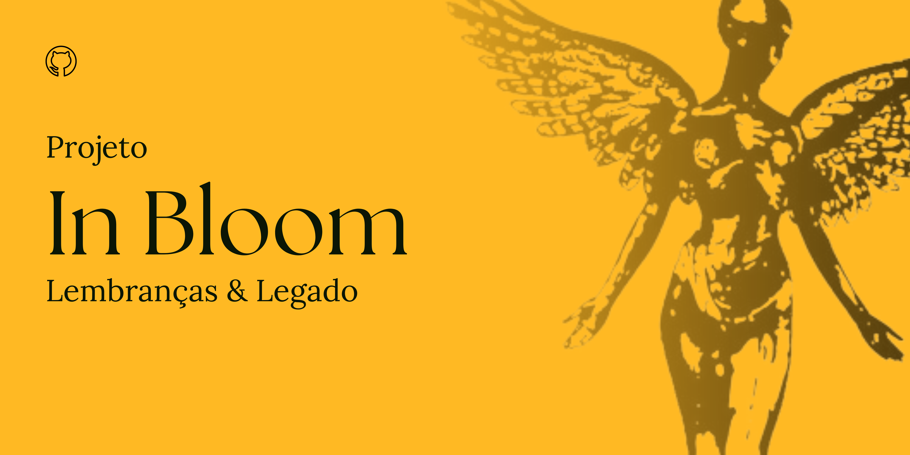

# In Bloom: Lembranças & Legado

## Descrição
Bem-vindo à In Bloom, o destino definitivo para os apaixonados pela banda Nirvana. Nossa missão é trazer para você os melhores souvenirs, CDs, discos, pôsteres e uma variedade de produtos exclusivos, tudo isso com o foco no legado eterno da banda que marcou gerações.

## Nosso Compromisso
Na In Bloom, nos dedicamos a oferecer uma experiência de compra simples e segura, perfeita para todos os fãs, independentemente da idade. Desde os clássicos álbuns em vinil até camisas exclusivas e colecionáveis, nosso catálogo é pensado para atender aos desejos de todos os admiradores do Nirvana.

## Público-alvo
Embora nosso público principal seja formado por fãs de todas as idades, encontramos inspiração nos novos admiradores da banda. Nosso design elegante e minimalista, com um layout intuitivo, reflete nosso compromisso em unir o passado e o presente do Nirvana.

## Estilo Visual
Inspirados pelas cores originais da banda, nossa paleta preta e amarela traz um toque de nostalgia, enquanto a tipografia limpa e simples complementa nosso design elegante.

## Logo
- O triângulo representa os três integrantes principais da banda: Kurt Cobain, Krist Novoselic e Dave Grohl.
- A mulher alada é o símbolo da capa do último álbum da banda.
- "In Bloom" é inspirada no nome de uma das melhores músicas do Nirvana.
- **Slogan**: "Lembranças e Legado" transmite a mensagem que a In Bloom quer passar para seus clientes; são nas lembranças de souvenirs que vendemos que resgatamos e passamos adiante o legado da banda que revolucionou a forma de fazer rock nos anos 90.
- A colorimetria do logo da In Bloom também é influenciada pela própria colorimetria original do Nirvana.

## Paletas de Cores da In Bloom

As cores que serão utilizadas em In Bloom serão inspiradas na paleta da própria banda Nirvana. As cores escolhidas são preto, amarelo e amarelo mostarda. Para homenagear ainda mais a banda, nomeei as cores com os nomes dos integrantes:
- Preto será chamado de Cobain.
- Dourado será Grohl.
- Amarelo será Novoselic.

## Estrutura do Projeto
O projeto está organizado da seguinte forma:

- **index.html**: Página inicial do site.
- **produtos.html**: Página de exibição dos produtos.
- **compra_produto.html**: Página destinada na compra e detalhamento dos produtos. 
- **contatos.html**: Página de contato para interação com os clientes.
- **sobre.html**: Página com informações sobre a loja.

## Recursos Utilizados
- **HTML**: Estruturação das páginas.
- **CSS**: Estilização e design das páginas.
- **JavaScript**: Funcionalidades interativas e dinâmicas.

## Conclusão
Prepare-se para uma experiência única na In Bloom, uma loja criada com muito amor de fã para fã. Cada detalhe celebra a música e o espírito do Nirvana.

## Como Contribuir
1. Faça um fork do repositório.
2. Clone o seu fork: `git clone https://github.com/Maysa502/In-Bloom.git`
3. Crie uma branch para sua modificação: `git checkout -b minha-modificacao`
4. Faça o commit das suas alterações: `git commit -am 'Adiciona nova funcionalidade'`
5. Faça o push para a branch: `git push origin minha-modificacao`
6. Envie um pull request.

## Referências
- [Programa ONE - Oracle Next Education](https://www.oracle.com/br/education/oracle-next-education/)
- [Curso de Html e CSS - Guanabara](https://youtu.be/Ejkb_YpuHWs?si=gmzLBkMnMcPpkM-U)
- [Curso de JavaScript - Matheus Battisti](https://youtube.com/playlist?list=PLnDvRpP8BneysKU8KivhnrVaKpILD3gZ6&si=lNpKN8_ta5HXfZu1)
- Javascript - Cangaceiro JavaScript - Uma Aventura no Sertão da Programação 
- Html5 e CSS3 - Domine a Web do Futuro 
- Desenvolvimento Web com HTML, CSS e JavaScript - Caelum, Curso WD-43

---

### "The sun is gone, but I have a light." — *Nirvana, Dumb*

---

Para mais detalhes sobre a estrutura do projeto, configuração e contribuição, consulte a [documentação completa](documentacao_codigo.md).

