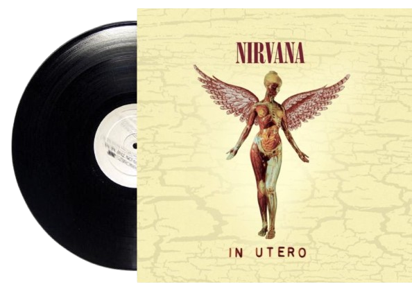
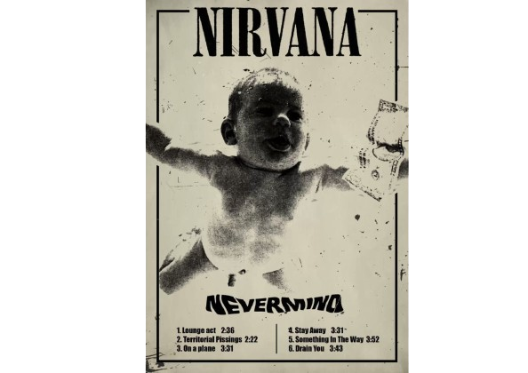
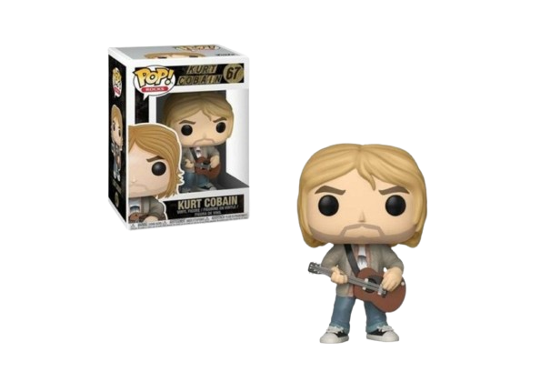

# Documentação do Site **In Bloom**


Este documento descreve a abordagem de desenvolvimento para o site **In Bloom**, um projeto dedicado à venda de produtos temáticos da banda Nirvana.

## Introdução

Para facilitar o desenvolvimento e atender às especificações do cliente, o site **In Bloom** foi desenvolvido em etapas distintas: a criação das páginas iniciais seguida pela ampliação conforme as especificações do cliente.

## Código Inicial

Inicialmente, foram criadas as estruturas básicas das páginas usando HTML, estilos CSS para layout e formatação. Este estágio focou na implementação fundamental do site, garantindo que todas as páginas estivessem funcionais e acessíveis.

## Finalização

Posteriormente, o desenvolvimento foi expandido para incluir mais detalhes conforme as especificações detalhadas pelo cliente. Isso envolveu refinamentos no design, adição de interatividade com JavaScript e ajustes finos para otimização de desempenho e experiência do usuário.

### Observação sobre o Processo

A divisão entre código inicial e finalização permitiu uma abordagem iterativa no desenvolvimento do site **In Bloom**, garantindo que as necessidades do cliente fossem atendidas de maneira eficiente e organizada.

## PAGE INDEX.HTML

### Código Inicial 

```html
<!DOCTYPE html>
<html lang="pt-br">
<head>
    <meta charset="UTF-8">
    <meta name="viewport" content="width=device-width, initial-scale=1.0">
    <title>Página Inicial - Nirvana</title>
    <link rel="stylesheet" href="styles.css"> <!--vinculando o CSS -->
</head>
<body>
    <header>
        <!-- Exibindo o logo da In Bloom -->
        
        
        <!-- Navegação principal do site -->
        <nav>
            <a href="#" class="nav-item active">Inicial</a> <!-- página inicial -->
            <a href="#" class="nav-item">Produtos</a> <!-- página de produtos -->
            <a href="#" class="nav-item">Contatos</a> <!-- página de contatos -->
            <a href="#" class="nav-item">Sobre</a> <!-- página sobre -->
        </nav>
    </header>

    <main>
        <!-- Seção introdutória -->
        <section class="intro">
            <h1>In Bloom</h1> <!-- Título -->
            <p>Coloca o texto da In bloom</p> <!-- Lugar pra colocar o paragrafo depois -->
        </section>
    </main>

    <footer>
        <!-- Ícones de redes sociais -->
        <div class="social-icons">
            <a href="#"></a> 
            <a href="#"></a> 
            <a href="#"></a>
        </div>
    </footer>
</body>
</html>
```

## Código Final

```html
<!DOCTYPE html>
<html lang="pt-br">
<head>
    <meta charset="UTF-8">
    <meta name="viewport" content="width=device-width, initial-scale=1.0">
    <title>Página Inicial - In Bloom</title>
    <link rel="stylesheet" href="styles.css"> <!--vinculando o CSS -->

    <style>
        /* Transição sobre os ícones sociais */
        .social-icons a {
            transition: transform 0.3s; /* Transição de 0.3 segundos para a propriedade transform - propriedade que permite aplicar transformações como escala e rotação. No caso dessa linha estou aplicando uma transição suave de 0.3s */
        }
        /* Defindo o efeito quando o mouse passa por cima */
        .social-icons a:hover {
            transform: scale(1.1); /* Escala os icons em 1.1 vezes o tamanho original */

        /*Portando o primeeiro trecho é posto o efeito e o segundo trecho de codigo é aplicado na interação do usuario*/
        }
    </style>

    <!-- Conexão com fontes do Google -->
    <link rel="preconnect" href="https://fonts.googleapis.com">
    <link rel="preconnect" href="https://fonts.gstatic.com" crossorigin>
    <!-- Importação da fonte "Lora" do Google Fonts -->
    <link href="https://fonts.googleapis.com/css2?family=Lora:ital,wght@0,400..700;1,400..700&display=swap" rel="stylesheet">
</head>
<body class="pagina-inicial pagina-index">
    <header>
        <!-- Exibe o logo da loja In Bloom -->
        
        
        <!-- Navegação principal -->
        <nav>
            <a href="index.html" class="nav-item active">Home</a> <!-- página inicial -->
            <a href="produtos.html" class="nav-item">Produtos</a> <!-- página de produtos -->
            <a href="contatos.html" class="nav-item">Contatos</a> <!-- página de contatos -->
            <a href="sobre.html" class="nav-item">Sobre</a> <!-- página sobre -->
            <a href="CompraProduto.html" class="nav-item">Comprar</a> <!-- página de compras -->
        </nav>
    </header>

    <main>
        <!-- Introduzindo os elemnetos da pagina home -->
        <section class="intro">
            <h1>Bem-vindo à In Bloom!</h1> <!-- Título de Boas Vindas a In Bloom-->
            <p>
                Na In Bloom, celebramos o rock com CDs, discos de vinil e camisetas da banda Nirvana. 
                Explore nosso catálogo e encontre peças únicas que vão elevar sua coleção e estilo. 
                Navegue, ouça e vista-se com a atitude que só a In Bloom pode oferecer.
            </p> 
        </section>
    </main>

    <footer>
        <!-- Ícones de redes sociais -->
        <div class="social-icons">
            <a href="https://github.com/Maysa502/In-Bloom"></a> <!-- Link para GitHub -->
            <a href="https://www.linkedin.com/in/maysaarruda"></a> <!-- Link para LinkedIn -->
            <a href="mailto:inbloomLoja87@gmail.com"></a> <!-- Link para Gmail-->
        </div>
    </footer>
</body>
</html>
```
### CSS DA PAGE INDEX.HTML
```css
/* css para a página inicial */
.pagina-inicial {
    background-image: url('background-inicial.png');
    
}

.intro {
    width: 30%;
    margin: 20px;
    background-color: rgba(0, 0, 0, 0.2);
    padding: 30px;
    border-radius: 60px;
    box-shadow: 0 0 10px rgba(0, 0, 0, 0.1);
}

.intro h1 {
    color: #e2cd65;
    font-size: 32px;
}

.intro p {
    color: #897834;
    font-size: 20px;
}
```

## PAGE PRODUTOS.HTML

### Código Inicial 
```html
<!DOCTYPE html>
<html lang="pt-BR">
<head>
    <meta charset="UTF-8">
    <meta name="viewport" content="width=device-width, initial-scale=1.0">
    <title>Produtos</title>
    <!-- Link para o arquivo de estilos externo -->
    <link rel="stylesheet" href="styles.css">
</head>
<body>
    <!-- cabeçalho -->
    <header>
        
        <nav>
            <a href="index.html" class="nav-item">Home</a>
            <a href="produtos.html" class="nav-item active">Produtos</a>
            <a href="contatos.html" class="nav-item">Contatos</a>
            <a href="sobre.html" class="nav-item">Sobre</a>
        </nav>
    </header>

    <!-- conteúdo principal da página -->
    <main>
        <!-- colocando o banner -->
        <section class="banner">
            <h1>Banner</h1>
            <div class="banner-container">
                
                <!-- navegação do banner -->
                <div class="banner-nav">
                    <span class="nav-circle"></span>
                    <span class="nav-circle"></span>
                    <span class="nav-circle"></span>
                </div>
            </div>
        </section>

        <!-- produtos -->
        <section class="produtos">
            <h1 class="produtos-title">Produtos</h1>
            <div class="categoria">
                <div class="categoria-title">Categoria</div>
                <!-- filtrando as categoria -->
                <div class="categoria-filtros">
                    <span>Bonecos</span>
                    <span>CDs</span>
                    <span>Vinils</span>
                    <span>Camisetas</span>
                    <span>Promoções</span>
                </div>
            </div>
            <!-- listando produtos -->
            <div class="produto-lista">
                <!-- lista de prodtudo teste -->
                <div class="produto-item">
                    
                    <h2 class="produto-nome">Produto 1</h2>
                    <p class="produto-preco">R$ 99,99</p>
                    <button class="produto-comprar">Comprar</button>
                    <button class="produto-carrinho">Adicionar ao Carrinho</button>
                </div>
            </div>
        </section>
    </main>

    <!-- Rodapé da página -->
    <footer>
        <div class="social-icons">
            
            
            
        </div>
    </footer>
</body>
</html>
```
### Código final
```html
<!DOCTYPE html>
<html lang="pt-BR">
<head>
    <meta charset="UTF-8">
    <meta name="viewport" content="width=device-width, initial-scale=1.0">
    <title>Produtos</title>
    <link rel="stylesheet" href="styles.css">
    <!-- Links para fontes google -->
    <link rel="preconnect" href="https://fonts.googleapis.com">
    <link rel="preconnect" href="https://fonts.gstatic.com" crossorigin>
    <link href="https://fonts.googleapis.com/css2?family=Lora:ital,wght@0,400..700;1,400..700&display=swap" rel="stylesheet">
</head>
<body class="pagina-produtos">
    <header>
        
        <nav>
            <a href="index.html" class="nav-item">Home</a>
            <a href="produtos.html" class="nav-item active">Produtos</a>
            <a href="contatos.html" class="nav-item">Contatos</a>
            <a href="sobre.html" class="nav-item">Sobre</a>
        </nav>
    </header>
    <main>
        <!-- banner -->
        <section class="banner">
            <h1>NewsVana</h1> <!--TITULO DO BANNER -->
            <div class="banner-container">
                
            </div>
        </section>

        <!-- produtos -->
        <section class="produtos">
            <h1 class="produtos-title">Produtos</h1>
            <div class="categoria">
                <a href="#" class="nav-item todos">Todos</a>
            </div>
            <div class="produto-lista">
                <!--produtos da In Bloom -->
                <div class="produto-item">
                        
                    </a>
                    <h2 class="produto-nome">Disco - In Utero</h2>
                    <p class="produto-preco">R$ 175,00</p>
                </div>
                <div class="produto-item">
                        
                    </a>
                    <h2 class="produto-nome">Poster - NeverMind 1</h2>
                    <p class="produto-preco">R$ 40,00</p>
                </div>
                <div class="produto-item">
                        
                    </a>
                    <h2 class="produto-nome">Boneco Kunk Kurt Cobain 1</h2>
                    <p class="produto-preco">R$ 478,99</p>
                </div>
            </div>
        </section>
    </main>

    <!-- Rodapé -->
    <footer>
        <div class="social-icons">
            <a href="https://github.com/Maysa502/In-Bloom"></a>
            <a href="https://www.linkedin.com/in/maysaarruda"></a>
            <a href="mailto:inbloomLoja87@gmail.com"></a>
        </div>
    </footer>
</body>
</html>
</html>
```
### CSS DA PAGE PRODUTOS.HTML
```css
/* css para a página de produtos */
.pagina-produtos {
    background-image: url('background-produtos.png');
    
}

.produtos {
    text-align: center;
    color: #e2cd65;
    margin: 20px 0;
}

.produtos-title {
    display: flex;
    align-items: center;
    justify-content: center;
}

.produtos-title::before,
.produtos-title::after {
    content: '';
    flex: 1;
    border-top: 2px solid #e2cd65;
    margin: 0 10px;
}

.categoria {
    display: flex;
    justify-content: space-between;
    align-items: center;
    margin-bottom: 20px;
    color: #e2cd65;;
}

.categoria-item:hover {
    border-color:  #e2cd65;;
    color: #e2cd65;;
}

.dropdown-btn {
    background-color: #897834;
    color: black;
    padding: 10px 20px;
    border: none;
    border-radius: 30px;
    cursor: pointer;
}

.dropdown-content {
    display: none;
    position: absolute;
    background-color: #f9f9f9;
    min-width: 160px;
    box-shadow: 0px 8px 16px 0px rgba(0, 0, 0, 0.2);
    z-index: 1;
}

.dropdown-content a {
    color: black;
    padding: 12px 16px;
    text-decoration: none;
    display: block;
}

.dropdown-content a:hover {
    background-color: #f1f1f1;
}

.categoria:hover .dropdown-content {
    display: block;
}

.produto-lista {
    display: flex;
    flex-wrap: wrap;
    justify-content: space-between;
    gap: 20px;
}

.produto-item {
    flex: 1 1 25%;
    background-color: rgba(0, 0, 0, 0.2);
    padding: 10px;
    border-radius: 60px;
    box-shadow: 0 0 10px rgba(0, 0, 0, 0.5);
    text-align: center;
    color: #897834;
    display: flex;
    flex-direction: column;
    justify-content: space-between;
    border: 2px solid #e2cd65;
    align-items: center;
}

.produto-img {
    width: 80%;
    height: auto;
    border-radius: 10px;
    margin-bottom: 10px;
    object-fit: cover;
}


.produto-comprar,
.produto-carrinho {
    background-color: #897834;
    color: black;
    border: none;
    padding: 10px 20px;
    border-radius: 30px;
    cursor: pointer;
    margin: 5px;
}

.produto-comprar:hover,
.produto-carrinho:hover {
    background-color: olive;
    color: black;
}

.produto-carrinho {
    background-color: whitesmoke;
}
```

## PAGE CONTATOS.HTML

### Código Inicial 
```html
<!DOCTYPE html>
<html lang="pt-br">
<head>
    <meta charset="UTF-8">
    <meta name="viewport" content="width=device-width, initial-scale=1.0">
    <title>Contatos</title>
    <link rel="stylesheet" href="styles.css">
</head>
<body>
    <header>
        
        <nav>
            <a href="index.html" class="nav-item">Home</a>
            <a href="produtos.html" class="nav-item">Produtos</a>
            <a href="contatos.html" class="nav-item active">Contatos</a>
            <a href="sobre.html" class="nav-item">Sobre</a>
        </nav>
    </header>

    <main>
        <!-- contatos seção principal -->
        <section class="contact-section">
            <h1 class="contact-title">Contate-nos</h1>
            <div class="contact-content">
                <div class="store-info">
                </div>
                <!-- Formulário -->
                <div class="contact-form">
                    <h2>Formulario de contato</h2>
                    <p>Preencha o formulário abaixo para nos contatar.</p>
                    <form>
                        <!-- os campos do formulário -->
                        <label for="name">Nome:</label>
                        <input type="text" id="name" name="name" required>
                        
                        <label for="email">Email:</label>
                        <input type="email" id="email" name="email" required>
                        
                        <label for="subject">Assunto:</label>
                        <input type="text" id="subject" name="subject" required>
                        
                        <label for="message">Mensagem:</label>
                        <textarea id="message" name="message" rows="4" required></textarea>
                        
                        <!-- adicionando o botão de envio -->
                        <button type="submit" class="submit-btn">Enviar</button>
                    </form>
                </div>
            </div>
        </section>
    </main>

    <!-- Rodapé da página -->
    <footer>
        <div class="social-icons">
            
            
            
        </div>
    </footer>
</body>
</html>
```
### Codigo Final 
```html
<!DOCTYPE html>
<html lang="pt-BR">
<head>
    <meta charset="UTF-8">
    <meta name="viewport" content="width=device-width, initial-scale=1.0">
    <title>Contatos</title>
    <link rel="stylesheet" href="styles.css">
</head>
<body class="pagina-contato">
    <header>
        
        <nav>
            <a href="index.html" class="nav-item">Home</a>
            <a href="produtos.html" class="nav-item">Produtos</a>
            <a href="contatos.html" class="nav-item active">Contatos</a>
            <a href="sobre.html" class="nav-item">Sobre</a>
        </nav>
    </header>
    <main>
        <section class="contact-section">
            <h1 class="contact-title">Contate-nos</h1>
            <div class="contact-content">
                <div class="store-info">
                    <h2>Estamos aqui para ajudar!</h2>
                    <p>Entre em contato conosco através dos meios abaixo e nossa equipe responderá o mais rápido possível.</p>
                    <p>Endereço:</p>
                    <p>Avenida Kurt Cobain, 987 - Bairro Seattle Sul, São Paulo, SP, CEP 04567-890</p>
                    <p>Telefone: (11) 9987-6543</p>
                    <p>E-mail: contato@inbloom.com.br</p>
                    <p>Horário de Atendimento:</p>
                    <p>Sexta: 10h - 19h</p>
                    <p>Sábado: 10h - 14h</p>
                    <p>Domingo: Fechado</p>
                </div>
                <!-- os campos de formulario -->
                <div class="contact-form">
                    <h1>Formulario de contato</h1>
                    <p>Preencha o formulário abaixo para nos contatar</p>
                    <form onsubmit="event.preventDefault(); showConfirmationMessage();">
                       
                        <label for="nome">Nome Completo:</label>
                        <input type="text" id="name" name="name" required>
                        
                        <label for="email">Email:</label>
                        <input type="email" id="email" name="email" required>
                        
                        <label for="message">Mensagem:</label>
                        <textarea id="message" name="message" rows="4" required></textarea>
                        
                        <button type="submit" class="submit-btn">Enviar</button>
                    </form>
                    <!-- mensagem de confirmação -->
                    <div id="confirmation-message-container"></div>
                </div>
            </div>
        </section>
    </main>

    <!-- Rodapé da página -->
    <footer>
        <div class="social-icons">
            <a href="https://github.com/Maysa502/In-Bloom"></a>
            <a href="https://www.linkedin.com/in/maysaarruda"></a>
            <a href="mailto:inbloomLoja87@gmail.com"></a>
        </div>
    </footer>
    <!-- configurando a mensagem de confirmação por js -->
    <script>
        function showConfirmationMessage() {
            const messageContainer = document.getElementById('confirmation-message-container'); // Selecionando o contêiner de mensagens de confirmação pelo ID
            const messageDiv = document.createElement('div'); // Aqui estou criando um novo elemento chamado 'div' 
            messageDiv.classList.add('confirmation-message'); // Adicionando a classe 'confirmation-message' a'div'
            messageDiv.textContent = 'Sua mensagem foi enviada com sucesso!';  // Definindo o texto do novo 'div'
            messageContainer.appendChild(messageDiv); // Colocando o 'div' ao contêiner de mensagens que criei la em cima
        }
    </script>
</body>
</html>
```

### CSS DA PAGE CONTATOS.HTML
```css
/* css para a página de contatos */
.pagina-contato {
    background-image: url('background-contato.png');
    
}

.contact-section {
    padding: 20px;
    text-align: center;
    color: #897834;
}

.contact-title {
    color: #897834;
    font-size: 36px;
    position: relative;
    display: flex;
    align-items: center;
    justify-content: center;
    margin-bottom: 40px;
}

.contact-title::before,
.contact-title::after {
    content: '';
    flex: 1;
    border-top: 2px solid #897834;
    margin: 0 10px;
}

.contact-title::before {
    left: -100px;
}

.contact-title::after {
    right: -60px;
}

.contact-content {
    display: flex;
    justify-content: space-between;
    align-items: flex-start;
}

/* bloco de informações da loja */
.store-info {
    width: 30%; /* Ajustando a largura */
    background-color: rgba(0, 0, 0, 0.2); /* Ajustando a cor de fundo */
    border: 2px solid #e2cd65; 
    border-radius: 50px; 
    padding: 20px; /* espaçamento interno conforme necessário */
    box-shadow: 0 0 10px rgba(0, 0, 0, 0.1); /* Sombreamento */
}

/* css para o bloco do formulário de contato */
.contact-form {
    width: 45%; /* largura  */
    background-color: rgba(0, 0, 0, 0.2); /* 0.2 pra opacidade */
    border-radius: 10px; 
    padding: 20px; /* ajustando o espaçamento interno */
    box-shadow: 0 0 10px rgba(0, 0, 0, 0.1); /* sombreamento */
}

.contact-form h2 {
    color: #e2cd65;
    margin-bottom: 10px; /*espaçamento entre os elementos*/
}

.contact-form p {
    color: #897834;
    margin-bottom: 20px;
}

.contact-form label {
    display: block; /*elemneto de bloco*/
    color: #e2cd65;
    margin-bottom: 5px;
}

/*css do formulario de envio do usuario*/
.contact-form input,
.contact-form textarea {
    width: 100%; /*largura*/
    padding: 10px; /*peenchimento interno de 10px*/
    margin-bottom: 10px;
    border: 1px solid #897834;
    border-radius: 5px;
    background-color: transparent; /* Fundo transparente */
    color: #e2cd65;
}

.submit-btn {
    background-color: #e2cd65;
    color: black;
    padding: 10px 20px; /*preenchimento do topo e pra direita*/
    border: none;
    border-radius: 10px;
    cursor: pointer; /*colocando o cursor em formato de mão*/
    font-weight: bold;
}
```

## PAGE SOBRE.HTML

### Codigo Inicial
```html
<!DOCTYPE html>
<html lang="pt-BR">
<head>
    <meta charset="UTF-8">
    <meta name="viewport" content="width=device-width, initial-scale=1.0">
    <title>Sobre</title>
    <link rel="stylesheet" href="styles.css">
</head>
<body>
    <header>
        
        <nav>
            <a href="index.html" class="nav-item">Home</a>
            <a href="produtos.html" class="nav-item">Produtos</a>
            <a href="contatos.html" class="nav-item">Contatos</a>
            <a href="sobre.html" class="nav-item active">Sobre</a>
        </nav>
    </header>
    <main>
        <section class="about-section">
            <div class="about-top">
                <h1>Sobre</h1>
                <p></p>
            </div>
            <div class="about-side">
                <h2 class="vertical-text">IN BLOOM</h2>
            </div>
            <div class="about-bottom">
                <p></p>
            </div>
        </section>
    </main>
    <footer>
        <div class="social-icons">
            
            
            
        </div>
    </footer>
</body>
</html>

```
### Codigo Final
```html
<!DOCTYPE html>
<html lang="pt-BR">
<head>
    <meta charset="UTF-8">
    <meta name="viewport" content="width=device-width, initial-scale=1.0">
    <title>Sobre</title>
    <link rel="stylesheet" href="styles.css">
    <link rel="preconnect" href="https://fonts.googleapis.com">
    <link rel="preconnect" href="https://fonts.gstatic.com" crossorigin>
    <link href="https://fonts.googleapis.com/css2?family=Lora:ital,wght@0,400..700;1,400..700&display=swap" rel="stylesheet">
</head>
<body class="pagina-sobre">
    <header>
        
        <nav>
            <a href="index.html" class="nav-item">Home</a>
            <a href="produtos.html" class="nav-item">Produtos</a>
            <a href="contatos.html" class="nav-item">Contatos</a>
            <a href="sobre.html" class="nav-item active">Sobre</a>
        </nav>
    </header>
    <main>
        <section class="about-section">
            <div class="about-top">
                <h1>Sobre</h1>
                <p>Somos especialistas em oferecer uma variedade de produtos oficiais da banda Nirvana,</p>
                <p>dedicados a conectar e transmitir o legado da banda através das várias gerações de fãs.</p>
                <p><strong>Nossa Missão</strong> é conectar e transmitir o legado da banda Nirvana através das várias gerações de fãs.</p>
            </div>
            <div class="about-side">
                <div class="about-text">
                    <h3>Nossos Valores</h3>
                    <p>Paixão pela Música: Vivemos e respiramos Nirvana.</p>
                    <p>Autenticidade: Produtos 100% oficiais e licenciados.</p>
                    <p>Comunidade: Unindo fãs de todas as idades.</p>
                    <p>Qualidade: Oferecendo produtos de alta qualidade.</p>
            
                    <h3>Nossa História</h3>
                    <p>Fundada há sete anos, a In Bloom cresceu com a paixão de fãs dedicados</p>
                    <p>e o compromisso de manter o espírito de Nirvana vivo.</p>
            
                    <h3>Nossa Equipe</h3>
                    <p>Nossa equipe é formada por fãs apaixonados e profissionais dedicados</p>
                    <p>a proporcionar a melhor experiência possível.</p>
                </div>
                <h2 class="vertical-text">IN BLOOM</h2>
            </div>
            <div class="about-bottom">
                <p><strong>Entre em Contato</strong></p>
                <p>Estamos aqui para você! Envie um email para <a href="mailto:inbloomLoja87@gmail.com">inbloomLoja87@gmail.com</a></p>
            </div>
        </section>
    </main>
    <footer>
        <div class="social-icons">
            <a href="https://github.com/Maysa502/In-Bloom"></a>
            <a href="https://www.linkedin.com/in/maysaarruda"></a>
            <a href="mailto:inbloomLoja87@gmail.com"></a>
        </div>
    </footer>
</body>
</html>
```

### CSS DA PAGE SOBRE.HTML
```css
/* cs para página Sobre */

.pagina-sobre {
    background-image: url('background-sobre.png');
    }

/*css da parte superior*/
.about-top {
    background-color: rgba(0, 0, 0, 0.2); /*fundo quase transparente*/
    border: none; 
    border-radius: 10px;
    padding: 20px;
    box-shadow: 0 0 10px rgba(0, 0, 0, 0.1); /*sombra*/
    text-align: left; /* alinhando o txt */
    color: #e2cd65; 
}

.about-top h1 {
    color: whitesmoke;
    font-size: 36px;
    margin-bottom: 10px;
}

.about-side {
    display: flex;
    justify-content: flex-end; /*deixando espaço para a esquerda, alinhando os itens para a direita*/
    background-color: rgba(0, 0, 0, 0.2);
    border: none; 
    border-radius: 10px;
    padding: 20px;
    box-shadow: 0 0 10px rgba(0, 0, 0, 0.1);
    text-align: right; /*deixando o txt na direita*/
    color: #e2cd65; 
}


.about-side {
    display: flex;
    justify-content: flex-end;
    background-color: rgba(0, 0, 0, 0.2);
    border: none; 
    border-radius: 10px;
    padding: 20px;
    box-shadow: 0 0 10px rgba(0, 0, 0, 0.1); /*sombreamento*/
}

.vertical-text {
    writing-mode: vertical-lr;
    text-orientation: sideways;
    transform: rotate(360deg);
    white-space: nowrap;
    color: #897834; 
    font-size: 75px;
    margin-left: 25px; /* espaçamento entre o texto vertical e o conteúdo à direita */
    letter-spacing: 20px; /* espaçamento entre as letras */
}

.about-text {
    flex-grow: 1; /*conteúdo à esquerda ocupando todo o espaço disponível */
}

.about-text h3 {
    color: whitesmoke; 
    font-size: 24px; 
    margin-top: 0; /* removendo as margens superior padrão dos títulos */
}

.about-text p {
    color: #e2cd65; 
    font-size: 16px; 
    line-height: 1.5; /* espaçamento entre linhas do texto */
    margin-top: 5px; /* espaçamento superior entre os parágrafos */
}


/*txt do final da pagina*/
.about-bottom {
    background-color: rgba(0, 0, 0, 0.2);
    border: none; 
    border-radius: 10px;
    padding: 20px;
    box-shadow: 0 0 10px rgba(0, 0, 0, 0.1);
    text-align: left; /*alinhando o texto a esquerda*/
    color: #897834; 
}
```

### CSS 
``` css
/* css do doc global */
body {
    margin: 0;
    font-family: 'Lora', serif;
    display: flex;
    flex-direction: column;
    min-height: 100vh;
    background-size: cover;
    background-position: center;
    position: relative;
}
header {
    background-color: rgba(0, 0, 0, 0.5);
    padding: 10px;
    display: flex;
    justify-content: space-between;
    align-items: center;
    height: 100px;
}

.logo {
    max-height: 115px;
    margin-left: 60px;
}
.logo img {
    height: 100%;
    width: auto;
}
nav {
    display: flex;
    gap: 10px;
}
.nav-item {
    color: #897834;
    text-decoration: none;
    padding: 5px 15px;
    border-radius: 60px;
    border: 2px solid #897834;
    margin-left: 15px;
}
.nav-item.active {
    background-color: #897834;
    color: black;
}
main {
    flex: 1;
    padding: 20px;
}
footer {
    background-color: #897834;
    padding: 10px;
    display: flex;
    justify-content: flex-end;
    align-items: center;
    margin-top: auto;
}
.social-icons img {
    height: 15px;
    margin-left: 140px;
}

/* css do rodapé */
footer {
    background-color: #897834;
    padding: 10px;
    display: flex;
    justify-content: flex-end;
    align-items: center;
    margin-top: auto;
}
.social-icons {
    display: flex;
    gap: 10px;
}
.social-icons a {
    transition: transform 0.3s;
}
.social-icons a:hover {
    transform: scale(1.1);
}

/* adicionando fade-in nas pgs */
body {
    opacity: 0;
    transition: opacity 1s ease-in;
}
body.loaded {
    opacity: 1;
}

/* efeito nos ícones sociais */
.social-icons a {
    transition: transform 0.3s;
}
.social-icons a:hover {
    transform: scale(1.1);
}
```
